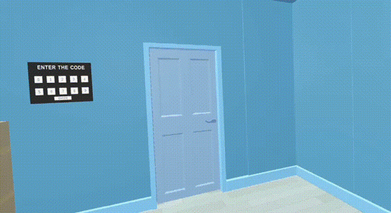

# EscapeRoomVR

A Virtual Reality escape room developed for the Computer Graphics exam.  
The project was developed with Unity 2022.3.5f1 using C# scripting and built for Meta Quest 2.

---

## 🎮 Gameplay Preview

---

## 🧩 Description

The game consists of three main areas that can be unlocked by solving various puzzles in Virtual Reality.
